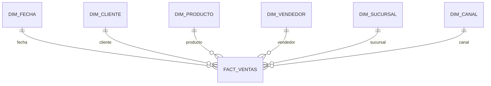

# Sales Power BI Dashboard

Proyecto de portafolio que transforma datos ficticios de ventas de una ferretería peruana en una fuente limpia para PostgreSQL y Power BI.

## Objetivo

Construir un flujo reproducible para analizar ventas, clientes, productos, vendedores, sucursales y rentabilidad.

```text
CSV original -> Python/Pandas -> CSV limpio -> PostgreSQL -> Power BI
```

## Estado actual

- Dataset original: 10,000 líneas de venta.
- Periodo: enero de 2024 a agosto de 2026.
- Moneda: soles peruanos (PEN).
- Script de limpieza y validación terminado.
- Modelo dimensional para PostgreSQL terminado.
- Carga automatizada a PostgreSQL terminada.
- Dashboard de Power BI: pendiente.

## Estructura

```text
sales-powerbi-dashboard/
├── data/
│   ├── raw/
│   │   └── sales_data_ferreteria_10000.csv
│   └── processed/
│       └── sales_data_clean.csv
├── images/
├── powerbi/
├── python/
│   ├── clean_data.py
│   └── load_postgres.py
├── reports/
│   └── data_quality_report.json
├── sql/
│   ├── 01_schema.sql
│   ├── 02_transform.sql
│   └── 03_views.sql
├── .env.example
├── .gitignore
├── README.md
└── requirements.txt
```

## Ejecutar la limpieza

### Windows PowerShell

```powershell
py -m venv .venv
.venv\Scripts\Activate.ps1
pip install -r requirements.txt
python python\clean_data.py
```

### Linux o macOS

```bash
python3 -m venv .venv
source .venv/bin/activate
pip install -r requirements.txt
python python/clean_data.py
```

El script lee `data/raw/sales_data_ferreteria_10000.csv` y crea:

- `data/processed/sales_data_clean.csv`
- `reports/data_quality_report.json`

## Modelo dimensional PostgreSQL

El modelo contiene seis dimensiones y una tabla de hechos:

- `dim_fecha`
- `dim_cliente`
- `dim_producto`
- `dim_vendedor`
- `dim_sucursal`
- `dim_canal`
- `fact_ventas`

`fact_ventas` se relaciona con las dimensiones mediante claves foráneas. También se crea `vw_ventas_powerbi`, una vista plana útil para revisar los datos.



## Cargar PostgreSQL

Primero crea una base de datos vacía llamada `sales_powerbi`. Después configura las variables de conexión.

### Windows PowerShell

```powershell
$env:PGHOST="localhost"
$env:PGPORT="5432"
$env:PGDATABASE="sales_powerbi"
$env:PGUSER="postgres"
$env:PGPASSWORD="TU_CONTRASEÑA"
python python\load_postgres.py
```

### Linux o macOS

```bash
export PGHOST="localhost"
export PGPORT="5432"
export PGDATABASE="sales_powerbi"
export PGUSER="postgres"
export PGPASSWORD="TU_CONTRASEÑA"
python python/load_postgres.py
```

El proceso crea las tablas, carga el CSV y muestra la cantidad de registros de cada tabla. Puedes ejecutarlo nuevamente sin duplicar ventas.

## Validaciones realizadas

- Columnas obligatorias.
- Identificadores de venta únicos.
- Conversión de fecha, hora y campos numéricos.
- Eliminación de espacios innecesarios en textos.
- Control de cantidades, precios, descuentos y márgenes.
- Revisión de cálculos de venta neta, costo total y utilidad.
- Creación de columnas de año, mes, trimestre y día.

## Próximas etapas

1. Ejecutar PostgreSQL y comprobar la carga en tu computadora.
2. Conectar Power BI a PostgreSQL.
3. Crear medidas DAX y páginas del dashboard.
4. Añadir capturas y publicar el repositorio en GitHub.

## Datos

Todos los nombres, clientes y movimientos del dataset son ficticios y fueron creados únicamente con fines educativos y de portafolio.
