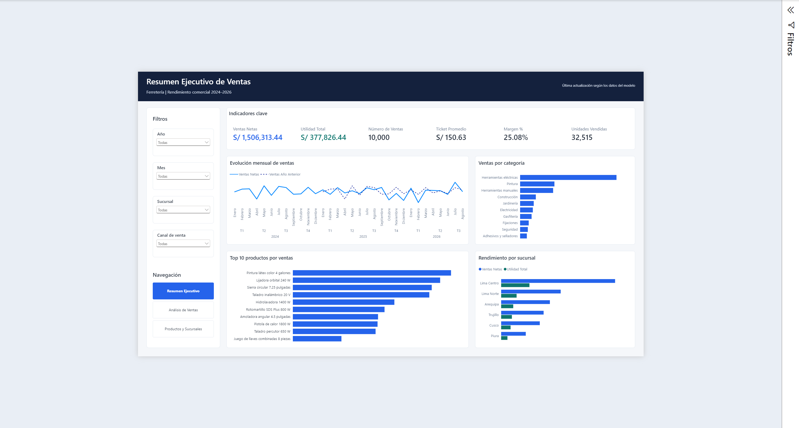
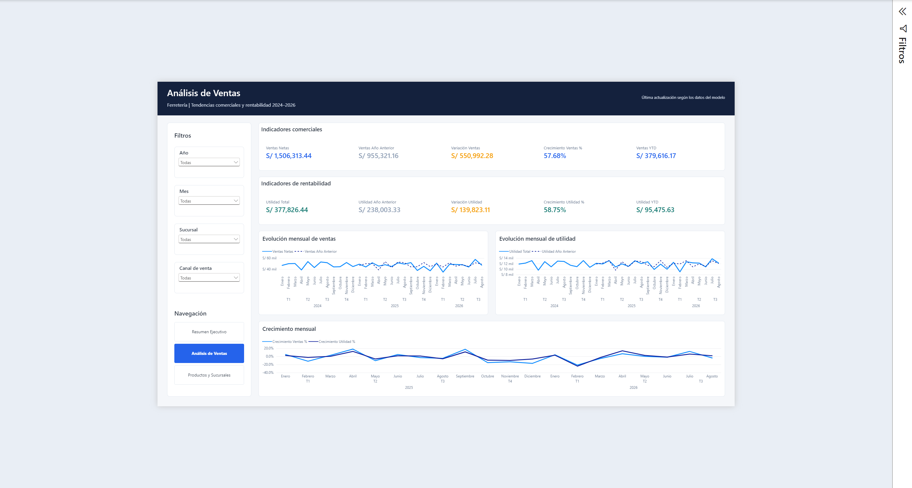
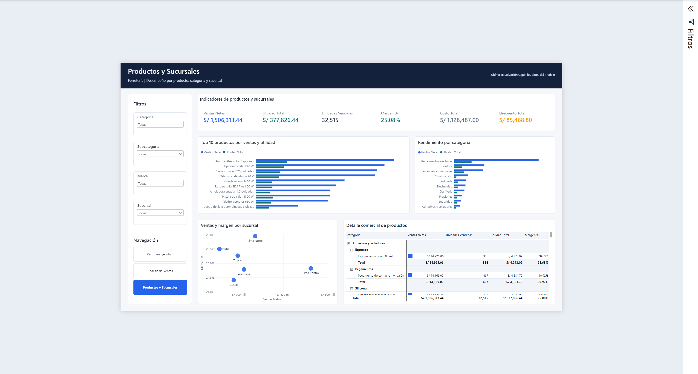
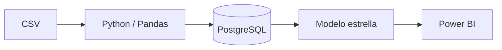
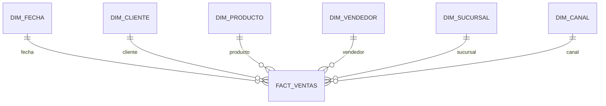

# Sales Power BI Dashboard — Ferretería

Proyecto integral de inteligencia de negocios que transforma 10 000 registros ficticios de ventas de una ferretería peruana en un dashboard interactivo de Power BI. La solución cubre limpieza y validación con Python, almacenamiento dimensional en PostgreSQL, modelado semántico y visualización ejecutiva en formato PBIP/PBIR.

## Objetivo empresarial

Facilitar el seguimiento de ventas, rentabilidad, volumen y desempeño comercial para responder preguntas como:

- ¿Cómo evolucionan las ventas y la utilidad frente al año anterior?
- ¿Qué productos, categorías y sucursales generan mejores resultados?
- ¿Cuál es el margen obtenido y cómo se comportan las variaciones acumuladas?
- ¿Qué canales, periodos y segmentos requieren mayor atención?

## Vista principal



## Páginas del informe

### Resumen Ejecutivo

Presenta los indicadores principales, la evolución mensual, las categorías y productos líderes y el rendimiento por sucursal.


### Análisis de Ventas

Profundiza en la evolución de ventas y utilidad, las comparaciones interanuales, el crecimiento mensual y los acumulados YTD.



### Productos y Sucursales

Permite analizar categorías, subcategorías, marcas, productos y sucursales mediante indicadores, rankings, comparación de margen y una matriz jerárquica de detalle.



## Características principales

- Tres páginas navegables con diseño ejecutivo consistente.
- Segmentadores por fecha, producto, sucursal y canal de venta.
- Modelo estrella con seis dimensiones y una tabla de hechos.
- Dieciocho medidas DAX organizadas por indicadores base, ratios e inteligencia de tiempo.
- Comparaciones con el año anterior, variaciones, crecimiento y acumulados YTD.
- Top 10 de productos y análisis de ventas, utilidad, margen, costos y descuentos.
- Proceso reproducible de limpieza, control de calidad y carga idempotente a PostgreSQL.
- Proyecto Power BI en formato de desarrollo PBIP/PBIR, apto para control de versiones.

## Tecnologías utilizadas

- Power BI
- PBIP/PBIR
- PostgreSQL
- Python
- Pandas
- SQL
- Git

## Arquitectura



El CSV se limpia y valida con Python y Pandas. La carga automatizada crea y alimenta el esquema dimensional `bi_ferreteria` en PostgreSQL. Power BI consulta las tablas del modelo estrella y expone las métricas mediante el modelo semántico.

## Modelo dimensional

- `fact_ventas`: detalle de cada línea de venta, cantidades, precios, descuentos, costos, utilidad y margen.
- `dim_fecha`: calendario diario con año, número y nombre de mes, trimestre y día de la semana.
- `dim_producto`: catálogo de productos con categoría, subcategoría y marca.
- `dim_cliente`: clientes y tipo de cliente.
- `dim_sucursal`: sucursales y ciudades.
- `dim_canal`: combinación de canal de venta y medio de pago.
- `dim_vendedor`: catálogo de vendedores.



La definición completa de tablas y campos está disponible en [docs/data-dictionary.md](docs/data-dictionary.md).

## Principales indicadores

- Ventas Netas
- Utilidad Total
- Número de Ventas
- Ticket Promedio
- Margen %
- Unidades Vendidas
- Ventas y utilidad del año anterior
- Variaciones absolutas y porcentuales
- Ventas YTD y Utilidad YTD

## Dataset

- 10 000 registros ficticios de venta.
- Operación simulada de una ferretería peruana.
- Importes expresados en soles peruanos.
- Periodo comprendido entre el 1 de enero de 2024 y el 31 de agosto de 2026.
- 56 productos.
- 401 identificadores de cliente distintos.
- 15 vendedores.
- 6 sucursales.

El conteo de clientes se obtuvo directamente del CSV incluido en el repositorio.

## Estructura principal

```text
sales-powerbi-dashboard/
├── data/
│   ├── raw/                         # Dataset ficticio original
│   └── processed/                   # CSV limpio generado localmente
├── docs/
│   ├── data-dictionary.md
│   ├── portfolio-summary.md
│   └── setup.md
├── images/                          # Capturas del informe
├── powerbi/
│   ├── sales-powerbi.Report/        # Definición PBIR
│   ├── sales-powerbi.SemanticModel/ # Modelo semántico TMDL
│   └── sales-powerbi.pbip
├── python/
│   ├── clean_data.py
│   └── load_postgres.py
├── reports/                         # Reporte de calidad generado localmente
├── sql/
│   ├── 01_schema.sql
│   ├── 02_transform.sql
│   └── 03_views.sql
├── .env.example
├── README.md
└── requirements.txt
```

## Requisitos

- Power BI Desktop con soporte para proyectos PBIP.
- PostgreSQL y la utilidad `psql`.
- Python 3.10 o superior.
- Dependencias incluidas en `requirements.txt`.

## Ejecución local

### 1. Crear y activar el entorno virtual

```powershell
py -m venv .venv
.venv\Scripts\Activate.ps1
python -m pip install --upgrade pip
pip install -r requirements.txt
```

### 2. Limpiar y validar el dataset

```powershell
python python\clean_data.py
```

El proceso genera `data/processed/sales_data_clean.csv` y `reports/data_quality_report.json`.

### 3. Crear la base de datos

Con PostgreSQL en ejecución, crea una base vacía llamada `sales_powerbi`:

```powershell
psql -h localhost -p 5432 -U postgres -d postgres -c "CREATE DATABASE sales_powerbi;"
```

### 4. Configurar la conexión local

Define `PGHOST`, `PGPORT`, `PGDATABASE`, `PGUSER` y `PGPASSWORD` únicamente en tu sesión local. No confirmes contraseñas ni archivos `.env` en Git.

### 5. Cargar PostgreSQL

```powershell
python python\load_postgres.py
```

La carga crea las tablas, transforma el staging, actualiza registros por clave y genera la vista `bi_ferreteria.vw_ventas_powerbi`.

### 6. Abrir Power BI

Abre el archivo:

```text
powerbi\sales-powerbi.pbip
```

Si las credenciales o el servidor PostgreSQL cambian, actualiza la conexión de origen localmente en Power BI Desktop sin confirmar credenciales en el repositorio.

Consulta la guía completa en [docs/setup.md](docs/setup.md).

## Seguridad y privacidad

- Todos los datos, clientes, vendedores y movimientos son ficticios.
- El proyecto se creó exclusivamente con fines educativos y de portafolio.
- Las credenciales de PostgreSQL se configuran localmente mediante variables de entorno.
- `.env`, `auth.json`, credenciales, cachés y artefactos de recuperación están excluidos del repositorio.

## Autor

Gabriel Ruiz
